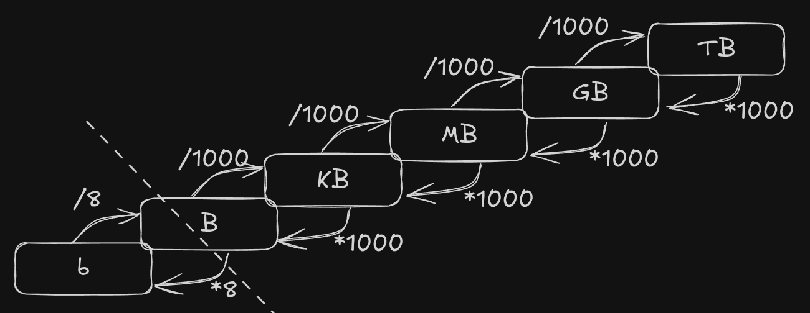
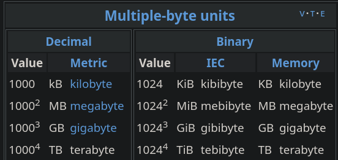
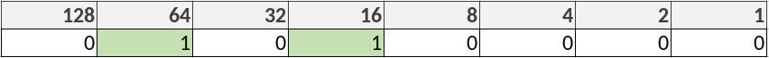
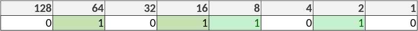
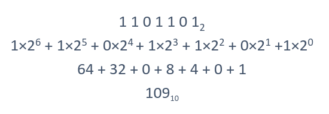
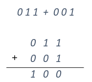
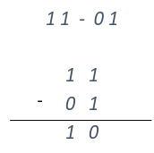
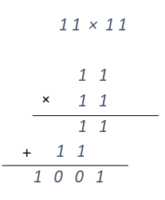

## Conversión entre diferentes Unidades
Existen dierentes unidades según la cantidad que queramos medir.
El dato más pequeño existente es el bit, la información se guarda en bytes (8 bits).
En casos en los que tenemos grandes volúmenes de información, se utilizan otras unidades, como por ejemplo el KB (1000/1024 Bytes).

Existen 2 Unidades de Medida para estos casos, estos son:
-  **Binario**: utilizado internamente por ordenadores, cada nivel (KB -> MB) son 1024
-  **Internacional**: más fácil de calcular para humanos, cada nivel son 1000

⚠️ Deberemos saber con qué sistema estamos trabajando para saber si multiplicar/dividir por 1000 o por 1024. 
Recuerda: un **Gibibyte** hace referencia a que es en Binario, un Gigabyte será en decimal⚠️

---
## Conversión entre Binario y Decimal

El binario se basa en potencias de 2.
Podemos saber cuál sería el número en decimal a partir de la posición de los números **1**, por ejemplo en la siguiente imagen vemos que tenemos **1**s en la posición de **64** y de **16**, esto significa que nuestro número en decimal será **64+16=80**

Para convertir de decimal a binario, podemos hacer utilizar el mismo método, por ejemplo:
Si tenemos el 90:
La forma más rápida será restando en los números de la tabla, si este es mayor a  nuestro número, pondremos un 0 y pasaremos al siguiente, si es menor, se lo restaremos, y pondremos un 1 en su posición.

(128 > 90, con lo que ponemos un 0; 64 < 90, con lo que lo restaremos, nos quedamos con 26, ponemos un 1 en esta posición y probamos con el siguiente).

⚠️Dado que el sistema Binario se basa en potencias de 2, nuestra tabla siempre será de 1, 2, 4 , 8, 16, 32, 64, 128, 256, 512, 1024,...⚠️

El método más matemático, sería multimplicar cada bit por 2 elevado a su posición, por ejemplo:

---
## Hexadecimal
El sistema [hexadecimal](https://en.wikipedia.org/wiki/Hexadecimal) es un sistema  de numeración de base 16 (del 0 al 15).
1,2,3,...,9,A,B,C,D,E,F,1A,1B,...

### Conversiones
#### Hexadecimal a Decimal:
Podemos convertir un número **Hexadecimal** a **Decimal** sumando multiplciando cada cifra por **16** elevado a su posición y sumándolas
Por ejemplo:
$3AD = (3 × 16^2) + (10 × 16^1) + (13 × 16^0) = 941$
#### Hexadecimal a Binario
Para pasar un número Hexadecimal a Binario, convertiremos cada cifra a binario con 4 bits.
De Binario a Hexadecimal, será lo mismo, pasaremos cada 4 bits a Hexadecimal.

| (1001011100) | =   | 0010  | 0101 | 1100 |
| ------------ | --- | ----- | ---- | ---- |
|              | =   | 2     | 5    | C16  |
|              | =   | 25C16 |      |      |

---

### Operaciones en Binario
Funcionan igual que en Decimal, deberemos fijarnos bien en la posición de cada cifra.
#### Sumas

#### Restas

#### Multiplicación

