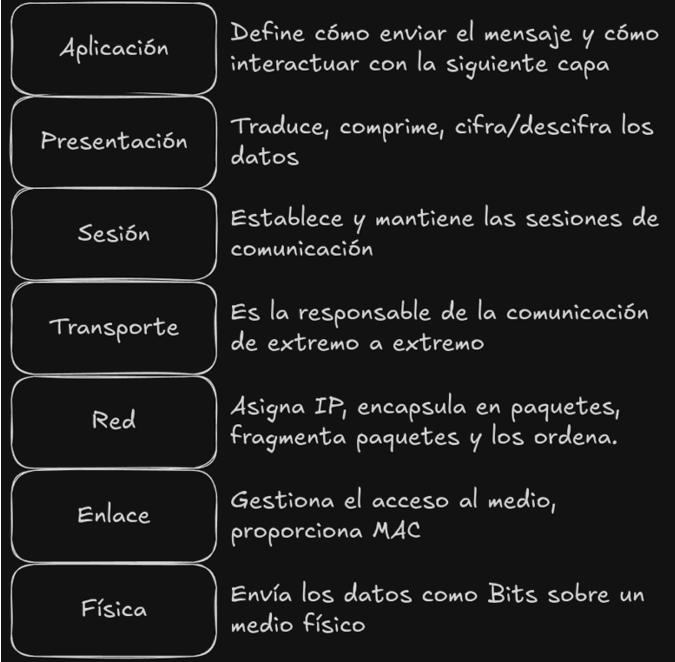

# Introducción a las Redes
## Definición
Una red es un conjunto de ordenadores conectados entre sí en la que pueden intercambiar y compartir información.

A mediados de los años 80 se popularizan las redes (oficinas)

---
## Host
Son los dispositivos que transmiten información, ya sea entre otros Host o con servidores. (También conocidos como Dispositivos Finales)
### Dispositivos Intermedios
Son aquellos por los que pasan los datos cuando se envían de un Host a otro.
Se encargan de que la información llegue al Host de destino
Los más comunes son los Routers (Capa 3) y los Switches (Capa 2-3).
## Medios de Red
Son los medios por los cuales se transmite la información, estos pueden ser cables o inalámbricos.

---
## Seguridad
Dado que se transmite mucha información importante, deberemos mantener los 3 principios de la seguridad, para esto, podemos usar:
- **Firewalls**: bloquean el tráfico malicioso o que no nos interese.
- **ACL**: Acces Control List, filtran el acceso.
- **IPS**: Sistemas de Prevención de Intrusiones, identifican amenazas.
- **VPN**: Redes Privadas Virtuales, proporcionan acceso seguro a una red remota.

---
## Arquitectura de red
Para que una red sea buena, deberá de cumplir las siguientes características:
- **Tolerancia a fallos**: en caso de problema, seguir en comunicación
- **Escalabilidad**: Posibilidad de ampliar la red en un futuro 
- **Calidad de Servicio (QoS)**: soportar el tráfico para evitar que se congestione 
- **Seguridad**: Todos los datos mantienen la Confidencialidad Integridad y Disponibilidad

---
## Tipos de Redes
Existen varias formas de diferenciar los tipos de redes. 
### Según su tamaño
- **WAN** (Wide Area Network): Conectan diferentes países (ej. Internet)
- **MAN** (Metropolitan): Conectan a nivel de ciudades.
- **LAN** (Local): Conecta dispositivos en una zona pequeña (ej. oficina)
- **PAN** (Personal): Conecta un dispositivo personal con otro (muy pequeñas)

### Topología
- **Física**: identifica cómo se conectan los dispositivos de una infraestructura.
- **Lógica**: cómo una red transmite de un nodo a otro.
Dentro de la **Topología Física**, tenemos diferentes tipos.

Las más comunes (actualmente) son:
- **Estrella**: Todos los dispositivos conectados a un nodo central (generalmente un Router), esta se utiliza en LANs
- **Malla**: Cada nodo está conectado a más de uno, la información puede pasar por varios para llegar al destino, esta utiliza Internet.
También podemos crear topologías híbridas (mixtas) combinando estas principales.

---
## Símplex, SemiDúplex y Dúplex
La información puede ir en una o en 2 direcciones, simultaneamente o en momentos diferentes.

- **Símplex**: En una sóla dirección.
- **SemiDúplex**: En ambas direcciones, pero no simultáneamente.
- **Dúplex**: Ambas direcciones simultaneamente.

---
## Medios
La información puede pasar por diferentes medios, ya sea **medios guiados** como es el caso de los cables o medios no guiados, como las conexiones inalámbricas, que pasan por el espacio.

---
## Ancho de Banda y Tasa de Transferencia
- **Ancho de Banda**: Es la capacidad máxima para transmitir.
- **Tasa de transferencia**: Volumen de datos que pasa por el ancho de banda.

---
## Tipo de señales
Las señales que se transmiten por medios físicos pueden ser **analógicas** y **digitales**.
En el caso de una **digital**, todos los valores son 0 o 1.

Mientras que en una **analógica**, puede haber valores intermedios (se tomará lo que más cerca esté, o lo que diga un protocolo de corrección).

En caso de querer convertir una señal a otra, deberemos modularla o codificarla.

---
## Arquitecturas de Comunicación
### Finalidad
Reduce la complejidad 
Cada capa lleva a cabo una función.
### Modelo OSI

Los mensajes Pasan por cada capa hasta llegar al destino, es decir se iniciará desde la Aplicación de un Host, pasará por todas las capas hasta llegar a la física, que lo enviará por el medio físico hasta la capa física
Es el estándar de transmisión de datos
### Modelo TCP/IP
Funciona igual que el modelo OSI, pero simplificado en 4 capas.

En cada capa añade una cabecera con la que asegurar la correcta transmisión.

---
## Protocolos
Son el conjunto de normas a seguir para permitir la comunicación, por ejemplo TCP o UDP.

